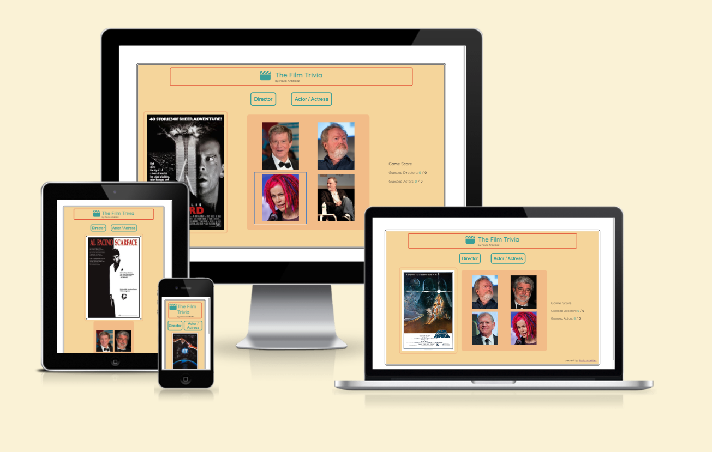
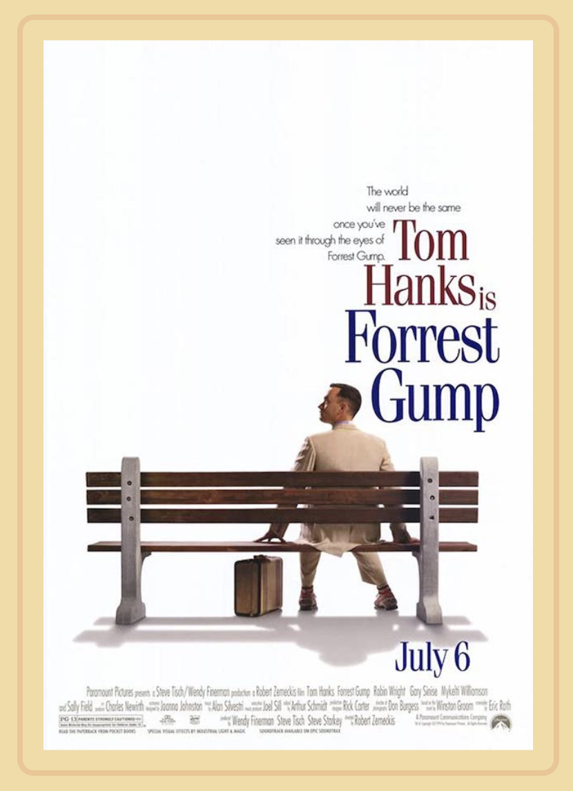
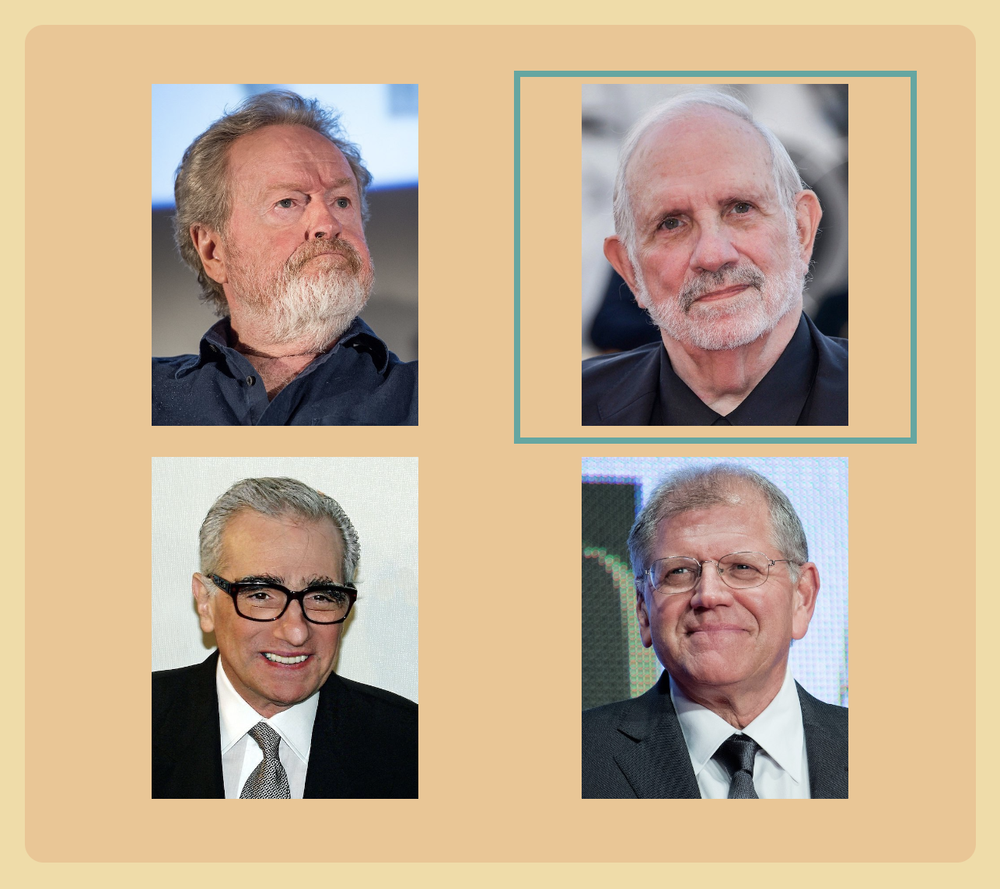
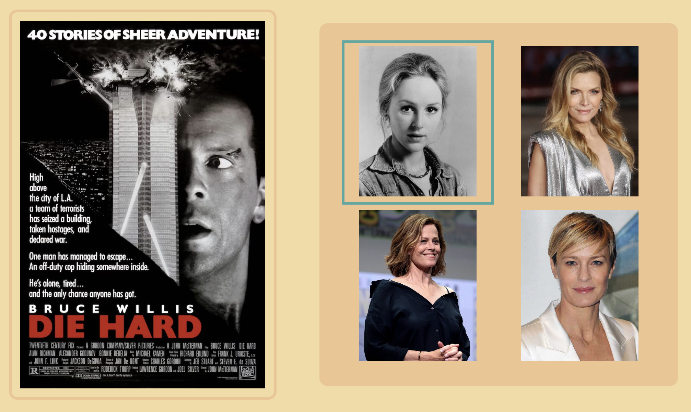
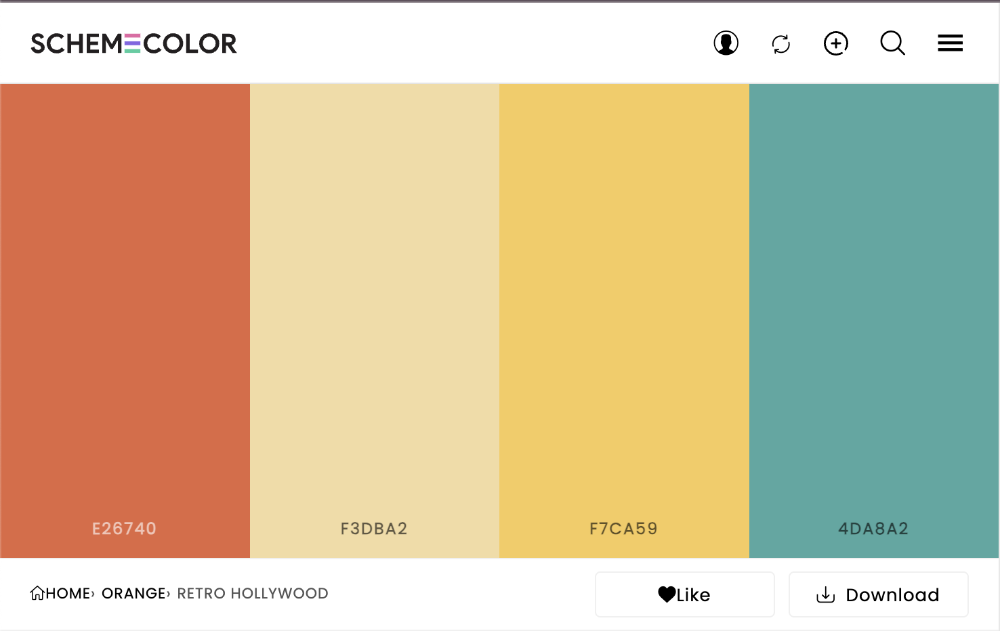
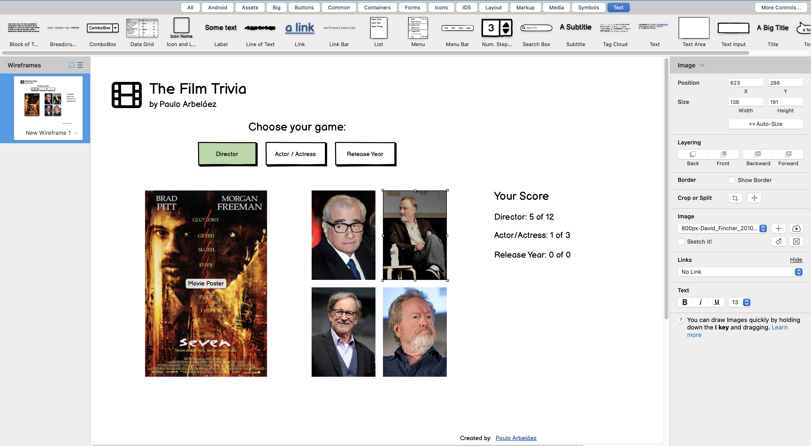

# Welcome to my film trivia game,

This is the second project for the full stack development course of Code Institute. It is a web page that contains a film trivia game in which the user will need to match the picture of the director and/or the actor of the movie of the film on the left side of the page.



For now, 10 films are included, but the database will be expanded over time, as it has been created in a way that could contain up to a thousand movies.

[View The Film Trivia on GitHub Pages](https://parbelaez.github.io/the-film-trivia/)


<p>
    <a href="https://jigsaw.w3.org/css-validator/check/referer">
        
    </a>
</p>

- - -

## CONTENTS

* [User Experience (UX)](#User-Experience-(UX))
    * [Design Idea](#design-idea)
    * [How to Play](#how-to-play)
    * [Visual Concept](#visual-concept)
    * [Typography](#typography)
    * [Imagery](#imagery)
    * [Accessibility](#accessibility)
* [Technologies Used](#technologies-used)
    * [Languages Used](#languages-used)
    * [Frameworks, Libraries & Programs Used](#Frameworks,-Libraries-&-Programs-Used)
* [Deployment & Local Development](#deployment--local-development)
    * [Deployment](#deployment)
    * [Local Development](#local-development)
        * [How to Fork](#how-to-fork)
        * [How to Clone](#how-to-clone)
* [Validation](#validation)
* [Future Implementations](#Future-Implementations)
* [Found Bugs](#found-bugs)
* [Credits](#credits)

---

## User Experience (UX)

### Design Idea

The idea behind the game is to match the Film Poster with the photo of the director or the actor/actress. No text was used for the guessing, as film is a completely visual experience. Therefore, only the names are revealed as soon as a selection is made.

### How to Play

By default, the game is set to guess the director of the film. Each movie will be represented by its poster, and 4 alternatives for the director will be displayed.






There are two buttons to choose the kind of game the user would like to play: Director or Actor/Actress.


The Director option (default) has already been shown. The actor's option is the one above, but this one has a particularity: it is not necessarily the main character of the movie. So, for example, in Die Hard, the user must guess Bonnie Bedelia and not Bruce Willis.



### Visual Concept

The color palette was influenced by Wes Anderson's movies, and it was found at [Schemecolor](https://www.schemecolor.com/retro-hollywood.php)



### Typography

Google Fonts was used for the font and its variations:

* [Quicksand](https://fonts.google.com/share?selection.family=Quicksand:wght@300;500).

### Imagery

All images were taken from the Internet and the credits can be found here (https://parbelaez.github.io/the-film-trivia/credits.html).


### Accessibility

The website is as accessible and friendly as possible, for users and possible future developers. I have achieved this by:

* Simplicity, so the user knows graphically and intuitively what should be done.
* Using semantic HTML.
* Using descriptive alt attributes on images on the site.
* Providing information for screen readers where there are icons used and no text.
* Ensuring menus are accessible by marking the current page as current for screen readers.

- - -

## Technologies Used


### Languages Used

HTML and CSS were used to create this website's looks.
All logic was created by using JavaScript.


### Frameworks, Libraries & Programs Used

Balsamiq - Used to create wireframes.



Git - For version control.

Github - To save and store the files for the website.

Google Fonts - To import the fonts used on the website.

Font Awesome - For the iconography on the website.

Google Dev Tools - To troubleshoot and test features, and solve issues with responsiveness and styling.

[Favicon.io](https://favicon.io/) To create favicon.

[Am I Responsive?](http://ami.responsivedesign.is/) To show the website image on a range of devices.

[Shields.io](https://shields.io/) To add badges to the README

- - -

## Deployment & Local Development

### Deployment

GitHub Pages was used to deploy the live website. The instructions to achieve this are below:

1. Log in (or sign up) to Github.
2. Find the repository for this project, the-film-trivia.
3. Click on the Settings link.
4. Click on the Pages link in the left-hand side navigation bar.
5. In the Source section, choose main from the drop-down select branch menu. Select Root from the drop-down select folder menu.
6. Click Save. Your live Github Pages site is now deployed at the URL shown.

### Local Development

#### How to Fork

To fork the the-film-trivia repository:

1. Log in (or sign up) to Github.
2. Go to the repository for this project, Parbelaez/the-film-trivia.
3. Click the Fork button in the top right corner.

#### How to Clone

To clone the the-film-trivia repository:

1. Log in (or sign up) to GitHub.
2. Go to the repository for this project, Parbelaez/the-film-trivia.
3. Click on the code button, select whether you would like to clone with HTTPS, SSH or GitHub CLI and copy the link shown.
4. Open the terminal in your code editor and change the current working directory to the location you want to use for the cloned directory.
5. Type 'git clone' into the terminal and then paste the link you copied in step 3. Press enter.

- - -

## Validation

HTML and CSS are validated with 100% pass scores.

JavaScript was validated with JSHint and the warnings were all related to external libraries that were confused with variables by the algorithm and/or functions inside loops, as in the button events routine, which was based on the Love Math project.

- - -

## Future Implementations

As mentioned, the list of films could grow (without adapting the code) to 1000 movies.

Each film is an object of the ***"films"*** array.

```
    {
        "name": "name_of_the_movie",
        "movieImg": "xxx_movie.jpg",
        "director": "name_of_the_director",
        "directorImg": "xxx_director.jpg",
        "actor": "name_of_the_actor/actress",
        "actorImg": "xxx_actor.jpg",
        "releaseYear": release_year,
    }
```
---

## Found Bugs

- The favicon was not possible to be displayed until it was stored inside a folder ./assets/favicon/favicon.ico.

---

## Credits

- **Jubril Akoldade** my tutor, who invested the time to check everything and recommended me all the best practices, plus useful tips to make the game and the webpage better.
- All images' credits can be found in the images-credits.html and can be increased as new films get into the database.

