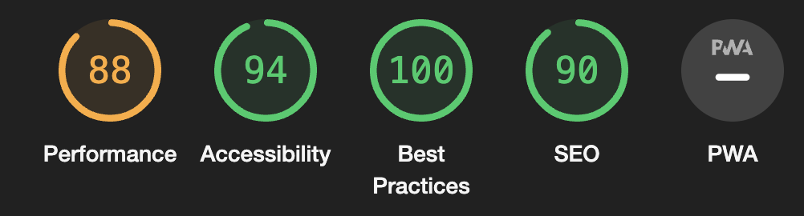
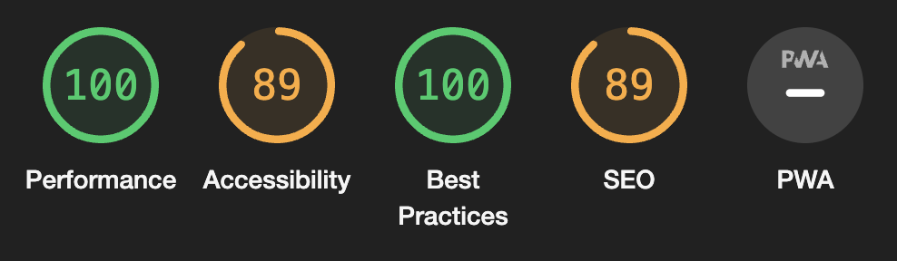
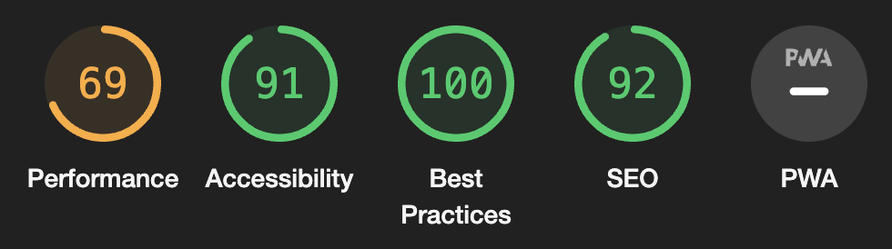
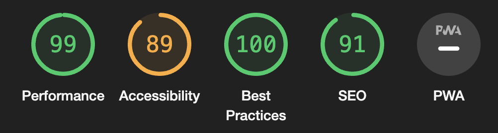
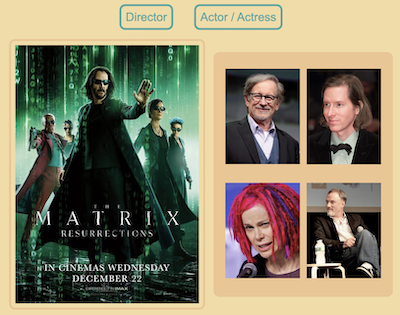
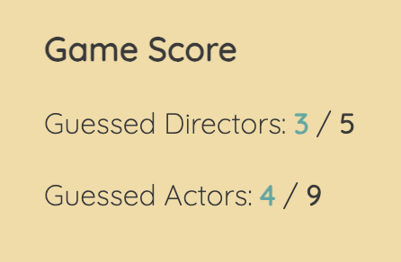

# The Film Trivia - TESTING

[View The Film Trivia on GitHub Pages](https://parbelaez.github.io/the-film-trivia/)

---

## CONTENTS

* [AUTOMATED TESTING](#AUTOMATED-TESTING)
  * [W3C Validator](#W3C-Validator)
  * [JavaScript Validator](#JavaScript-Validator)
  * [Python Validator](#Python-Validator)
  * [Lighthouse](#Lighthouse)
* [MANUAL TESTING](#MANUAL-TESTING)
  * [Testing User Stories](#Testing-User-Stories)
  * [Full Testing](#Full-Testing)

Testing was ongoing throughout the entire build. We utilised Chrome developer tools whilst building to pinpoint and troubleshoot any issues as we went along.

Each page and the functionalities of the game have been inspected using google chrome developer tools & Firefox inspector tool to ensure that each page is fully responsive on a variety of different screen sizes and devices. I have also physically tested the responsiveness of the site on a number of different devices.

- - -

## AUTOMATED TESTING

### W3C Validator

[W3C](https://validator.w3.org/) was used to validate the HTML of the website. It was also used to validate the CSS.

No warnings or errors were found

- - -

### JavaScript Validator

[jshint](https://jshint.com/) was used to validate the JavaScript.

No errors were found, and all warnings come from the libraries used to create the custom alerts (not errors, just the algorithm does not detect them as foreign callings.)

- - -

### Lighthouse

I used Lighthouse within the Chrome Developer Tools to test the performance, accessibility, best practices and SEO of the website.

### Desktop Results

* Game Page

* Images' Credits Page

Accesibility was lower than expected due to the contrast ratio generated by the blue on the title.

SEO does not apply for this page.

 

### Mobile Results

* Game Page

The performance was affected, mainly due to the sizes of the images. Nevertheless, the loading time and the actual data load is not significant, it just could be further optimmized in cases where no caching has taken place.

* Credits Page

Accesibility was lower than expected due to the contrast ratio generated by the blue on the title.

- - -

## MANUAL TESTING

### Testing User Stories

`Players`

| Goals | How are they achieved? | Image |
| :--- | :--- | :--- |
| As a first time user, I want to be able to easily understand the game rules. | I used a minimalistic approach in wich the film poster is displayed with all 4 possibilities at the right side. Therefore, the user only has the chance of interacting with the options and the game categories.  |  |
| As a user, I want to be able to track my performance. | At the right side, the score keeps track of how many images have been displayed per categorie, and how many have been correctly guess. No errors are track, so the user has better a success ratio, rather than a negative feedback. |  |

- - -

### Full Testing

Full testing was performed on the following devices:

* Laptop:
  * Macbook Pro 2022 16 inch screen
* Mobile Devices:
  * iPhone 12 pro.
  * iPhone 6s.
  * iPad Air 4.

Each device tested the site using the following browsers:

* Google Chrome
* Safari
* Firefox
* Edge

Additional testing was taken by friends and family on a variety of devices and screen sizes.  

Feature | Expected Outcome | Testing Performed | Result | Pass/Fail |
| --- | --- | --- | --- | --- |
| `Game Playability` |
| Game Categories Buttons | Correctly switches between Director and Actor/Actress Games | Click Buttons |  Switches Category or displays a new film to guess | Pass |
| Option Pictures Hover | Creates a border with padding for the hovered image | Hover | Creates the border | Pass |
| Choose an option | Brings a custom alert message indicating if the selected image was the correct on. If not, it should display the correct one with the name of the film and the name of the director or actor/actress, depending on the game category | Click the options' pictures | Displays the expected alert and start a new game to guess on the same category as the previous one. | Pass |

| `Home Page` |
| Click the Paulo Arbeláez link | Redirect to Project 1 webpage | Click link | Redirected to the portfolio page opening a new tab | Pass |
| Click on the Images Credits link  | Redirect to the credits page | Click the link | Redirected to the credits page | Pass |

| `Images' Credits Page` |
| Click the logo to get back to the game | Redirects to the game page | Click the logo | Redirected to the game page | Pass |
| Click the links on the credits | Redirects to the credits page opening a new tab | Click the links on the credits | Redirects to the credits page opening a new tab | Pass |

Back to [README.md](README.md)